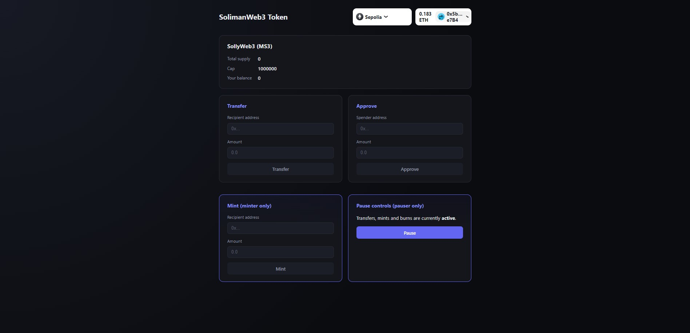

# SolimanWeb3 — ERC-20 Token + dApp

A production-shaped ERC-20 token built with Foundry and OpenZeppelin, with a full React frontend to interact with it. Live on Sepolia testnet.

**🔗 Live demo:** https://erc20-token-dapp.vercel.app/



## Contract features (`src/SolimanWeb3.sol`)

- **ERC-20 core** (OpenZeppelin) — name/symbol set at deploy time
- **Capped supply** — hard max enforced on-chain, immutable after deploy
- **Role-based access** (`AccessControl`) instead of single-owner:
  - `MINTER_ROLE` — can mint, up to the cap
  - `PAUSER_ROLE` — can pause/unpause transfers, mints, and burns
  - `DEFAULT_ADMIN_ROLE` — can grant/revoke the above
- **Burnable** — `burn` / `burnFrom`
- **Pausable** — emergency stop on all token movement
- **Permit (EIP-2612)** — gasless approvals via off-chain signature

## Deployed contract

**Sepolia:** [`0xc8cB361C0f66BB4c386290F6D487795569016FA6`](https://sepolia.etherscan.io/address/0xc8cB361C0f66BB4c386290F6D487795569016FA6)

## Project layout

```
src/SolimanWeb3.sol       the contract
test/SolimanWeb3.t.sol    46 Forge tests (unit + fuzz)
script/Deploy.s.sol       deploy script (reads PRIVATE_KEY from env)
frontend/                 React + wagmi + viem + RainbowKit dApp
```

## Usage

### Build

```shell
forge build
```

### Test

```shell
forge test
```

46 tests covering the constructor, mint (incl. cap enforcement), transfer, approve/allowance, transferFrom, burn/burnFrom, pause/unpause, role grant/revoke/renounce, and permit — plus fuzz tests on mint and transfer.

### Deploy

```shell
export PRIVATE_KEY=0x...
forge script script/Deploy.s.sol --rpc-url <your_rpc_url> --broadcast
```

Edit the `NAME` / `SYMBOL` / `CAP` constants at the top of `script/Deploy.s.sol` before deploying if you want different values.

### Frontend

See [`frontend/README.md`](frontend/README.md).

```shell
cd frontend
npm install
cp .env.example .env   # fill in VITE_CONTRACT_ADDRESS after deploying
npm run dev
```

## Built with

[Foundry](https://book.getfoundry.sh/) · [OpenZeppelin Contracts](https://docs.openzeppelin.com/contracts/) · [wagmi](https://wagmi.sh/) · [viem](https://viem.sh/) · [RainbowKit](https://www.rainbowkit.com/) · deployed on [Vercel](https://vercel.com/)